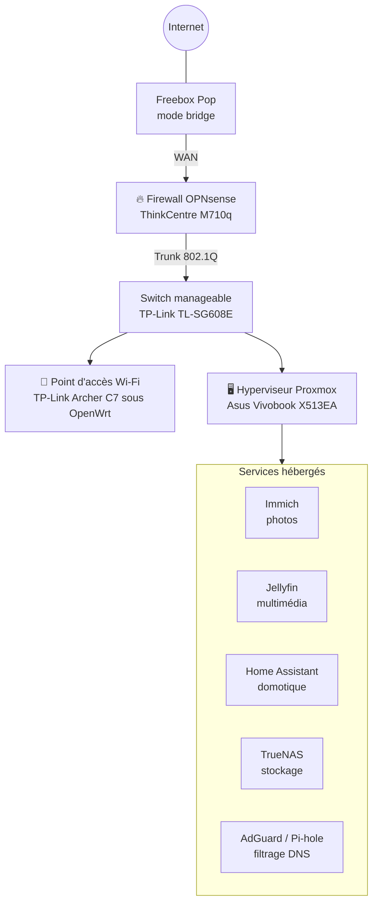
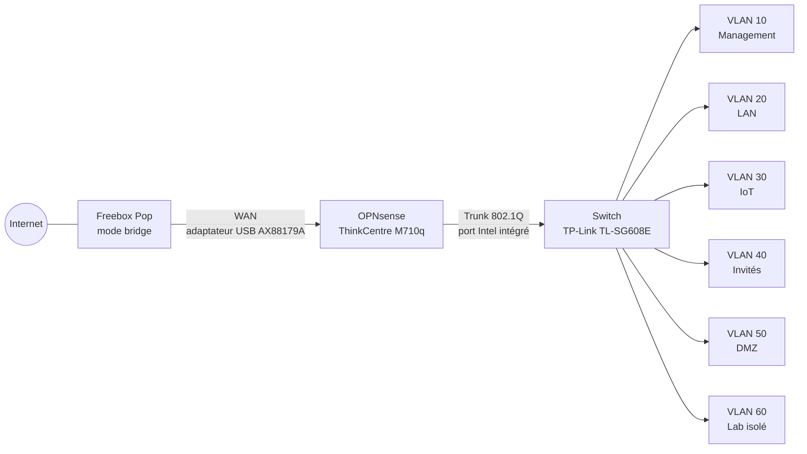

# 📓 Journal de bord — Homelab

> Conception, sécurisation et documentation d'une infrastructure réseau complète à domicile, avec un budget maîtrisé.

---

## 👋 Présentation

Bonjour à toutes et à tous ! Je m'appelle Théo et je suis étudiant en deuxième année du cycle ingénieur en informatique à Polytech Dijon, spécialisé en sécurité et qualité des réseaux. À travers ce journal, je partage l'ensemble des étapes de conception et de déploiement de mon homelab.

Le projet est né d'une envie simple : **apprendre en mettant en pratique** les notions vues en cours sur une infrastructure réelle, conçue, installée et administrée de bout en bout. Il fera l'objet d'une présentation lors de la soutenance de fin d'année, mais il est avant tout mené par intérêt personnel pour le réseau et la sécurité.

---

## 🎯 Objectifs

- **Sécuriser** : un firewall dédié, une segmentation du réseau en VLAN et l'application du principe du moindre privilège entre les segments.
- **Héberger soi-même ses services** : photos, multimédia, domotique, stockage et filtrage DNS, sans dépendre de services tiers.
- **Apprendre et documenter** : chaque choix est justifié, chaque compromis est assumé, chaque erreur est consignée avec sa solution.

---

## 🗺️ Architecture cible

Le schéma ci-dessous représente l'objectif à terme. Il évoluera au fil du projet.

L'ensemble prendra place dans un **mini rack 10"** imprimé en 3D au fablab de l'école.

---

## 📖 Comment lire ce journal

- **Organisation par thèmes** : chaque chapitre couvre un élément du homelab, de l'achat jusqu'à la mise en service. La chronologie se lit dans l'historique des commits.
- **Documentation technique** : les procédures pas à pas se trouvent dans le dossier [`docs/`](docs/). Ce journal se concentre sur le *pourquoi* et le déroulé du projet.
- **Version anglaise** : un README en anglais présentera le projet de façon synthétique.
- **Confidentialité** : les informations sensibles (IP publique, mots de passe, adresses MAC, exports de configuration) sont volontairement absentes ou anonymisées.

---

## 📑 Sommaire

| Chapitre | Statut |
|---|---|
| [🔥 Firewall — OPNsense](#-firewall--opnsense) | En cours |
| 🔀 Switch et VLAN | 🕓 |
| 📶 Wi-Fi — OpenWrt | 🕓 |
| 🖥️ Proxmox | 🕓 |
| 🧩 Services | 🕓 |
| 🗄️ Rack | 🕓 |

---

## 💰 Budget

| Chapitre | Montant | Détail |
|---|---|---|
| 🔥 Firewall | 70 € | ThinkCentre M710q (55 €) ✅ + adaptateur USB-A → RJ45 (15 €) |
| 🔀 Switch et VLAN | *à compléter* | |
| 📶 Wi-Fi | *à compléter* | |
| 🖥️ Proxmox | 15 € | Adaptateur USB-C → RJ45 (15 €) |
| 🧩 Services | *à compléter* | |
| 🗄️ Rack | *à compléter* | |
| **Total** | **85 €** | *mis à jour au fil du projet* |

---

## 🔥 Firewall — OPNsense

### 1. En bref

Le firewall est la porte d'entrée du homelab : toute communication entre Internet et le réseau de l'appartement passe par lui. Il repose sur un mini PC **Lenovo ThinkCentre M710q Tiny** reconditionné, acheté 55 €, qui fait tourner **OPNsense**. L'architecture retenue associe un **WAN physiquement séparé** et un **Router-on-a-Stick côté LAN** pour router et filtrer six VLAN. La Freebox Pop passe en mode bridge et ne fait plus que relier le réseau à la fibre.

---

### 2. Besoin et contexte

Dans une installation classique, la box de l'opérateur fait tout à la fois : modem, routeur, Wi-Fi et pare-feu basique. Tous les appareils se retrouvent sur un même réseau à plat et peuvent communiquer librement entre eux. Si un objet connecté est compromis, l'attaquant peut alors rebondir vers le reste du réseau.

L'objectif est de reprendre la main sur le réseau avec un équipement dédié capable de :

- **router** le trafic entre Internet et le réseau interne, et entre les différents segments internes ;
- **filtrer** ce trafic selon des règles explicites, en appliquant le principe du moindre privilège ;
- **segmenter** le réseau en VLAN (*Virtual LAN*, des réseaux logiques isolés qui partagent le même matériel physique) ;
- servir plus tard de socle à la **détection d'intrusion** (IDS) et au **VPN**.

Le firewall remplace donc la fonction de routeur de la Freebox Pop, qui passe en **mode bridge**. Dans ce mode, la box se contente de faire le lien entre la fibre et le réseau, sans routage, sans DHCP et sans Wi-Fi.

---

### 3. Choix et alternatives écartées

#### 3.1 Le logiciel : OPNsense plutôt que pfSense

OPNsense est né en 2015 d'un fork de pfSense. Les deux reposent sur **FreeBSD**, un système d'exploitation libre de la famille Unix réputé pour la solidité de sa pile réseau. pfSense CE est lui aussi open source : l'open source n'est donc pas, à lui seul, un critère de différenciation. Le choix d'OPNsense repose sur les points suivants :

| Critère | OPNsense | pfSense |
|---|---|---|
| Modèle de distribution | Une seule édition, entièrement open source | Édition CE open source, et pfSense Plus propriétaire mise en avant par l'éditeur |
| Mises à jour | Cycle régulier, correctifs de sécurité fréquents | Évolution de la version CE plus lente |
| Interface | Moderne, intuitive, API complète | Plus datée |
| Plugins utiles au projet | WireGuard, Suricata, Unbound intégrés | Disponibles également |

Pour un équipement exposé en permanence à Internet, la fréquence des correctifs de sécurité est le critère déterminant.

#### 3.2 La machine : ThinkCentre M710q Tiny

| Composant | Caractéristique | Intérêt pour un firewall |
|---|---|---|
| CPU | Intel Celeron G3900T : 2 cœurs / 2 threads, AES-NI, TDP 35 W | **AES-NI** : instructions qui accélèrent matériellement le chiffrement, utiles pour le VPN. **TDP 35 W** : gamme basse consommation, adaptée à un fonctionnement 24/7 |
| RAM | 8 Go (2 × 4 Go) | Largement suffisant pour OPNsense, avec de la marge pour Suricata |
| Stockage | SSD NVMe 250 Go | Un SSD supporte les écritures continues de logs |
| Format | Tiny | Compact, silencieux, compatible avec un mini rack 10" |
| Origine | Matériel professionnel reconditionné | Plateforme robuste et très répandue dans la communauté homelab |

**Limite assumée :** avec 2 cœurs, le processeur gère confortablement le routage et le filtrage, mais il pourrait devenir le goulot d'étranglement si Suricata est un jour activé en mode bloquant (voir *Perspectives*).

**HDD de 500 Go retiré.** La machine a été livrée avec un disque dur mécanique en plus du NVMe. Il a été retiré : OPNsense n'en a pas besoin, et une pièce mécanique ajoute de la consommation, de la chaleur et un risque de panne dans une machine allumée en permanence. Le disque est conservé pour un usage futur, par exemple des sauvegardes.

#### 3.3 La deuxième carte réseau

Un firewall a besoin d'au moins deux interfaces réseau (NIC : Network Interface Card) distinctes, une côté Internet (**WAN**) et une côté réseau interne (**LAN**). Le M710q ne possède qu'un seul port RJ45, et uniquement des ports USB-A. Il faut donc ajouter une carte réseau USB.

Sur FreeBSD, la compatibilité matérielle est plus restreinte que sur Linux, et c'est la **puce** de l'adaptateur qui compte, pas la marque.

| | Retenu ✅ | Écarté ❌ |
|---|---|---|
| Modèle | UGREEN USB-A → RJ45, 1 Gbps | UGREEN USB-A → RJ45, 2,5 Gbps |
| Puce | ASIX AX88179A | Realtek RTL8156BG |
| Support FreeBSD | Driver `axge`, AX88179A supporté depuis FreeBSD 13 | Retours de stabilité plus mitigés sur les puces Realtek USB |
| Prix | 15 € | 30 € |

**Pourquoi ne pas prendre le 2,5 Gbps ?** La Freebox Pop peut délivrer jusqu'à 2,5 Gbps sur un seul appareil (5 Gbps partagés entre ses ports, 900 Mbps en envoi). Mais le débit d'une chaîne réseau est celui de son maillon le plus lent. Ici, tout le trafic ressort par le port Intel du Tiny (1 Gbps), traverse le switch (ports 1 Gbps), et le Celeron ne saurait de toute façon pas router et filtrer 2,5 Gbps. Un WAN à 2,5 Gbps n'apporterait donc aucun gain tant que le reste de la chaîne reste en Gigabit. Pour une interface WAN, dont la défaillance coupe Internet pour tout l'appartement, **la stabilité prime sur le débit**.

**Compromis assumé :** l'ensemble de l'appartement partage un lien d'environ 940 Mbps utiles, au lieu d'environ 2 Gbps possibles sur un seul appareil branché directement sur la box. En pratique, l'écart reste invisible : le Wi-Fi et la plupart des appareils plafonnent en dessous de 1 Gbps, et le débit montant (900 Mbps) tient dans le lien Gigabit. Une petite part de débit théorique, non exploité, est échangée contre le contrôle total du réseau.

#### 3.4 Pourquoi l'adaptateur USB sert de WAN, et non de LAN

C'est un choix structurant, qui repose sur quatre arguments :

1. **Contrainte technique.** Le driver `axge` ne gère pas le *tagging* VLAN matériel. Or le lien LAN sera un **trunk 802.1Q**, c'est-à-dire un câble unique qui transporte plusieurs VLAN en ajoutant à chaque trame une étiquette indiquant son VLAN. Ce rôle revient donc naturellement au port Intel intégré, dont le driver est plus mature et mieux supporté.
2. **Charge de travail.** En Router-on-a-Stick, tout le trafic inter-VLAN entre et ressort par le lien LAN. C'est le lien le plus sollicité, il doit donc reposer sur l'interface la plus fiable. Le WAN, lui, ne porte qu'un lien simple, sans étiquette, vers la Freebox.
3. **Résilience.** Si l'adaptateur USB tombe en panne, seul l'accès à Internet est coupé. Le réseau interne (VLAN, DNS, services Proxmox) continue de fonctionner.
4. **Maintenance.** Un adaptateur USB se remplace en quelques secondes et pour une quinzaine d'euros, sans ouvrir la machine.

#### 3.5 L'architecture : Router-on-a-Stick côté LAN et WAN séparé

Le **Router-on-a-Stick (ROAS)** consiste à relier le routeur au switch par un seul lien trunk et à créer, sur le routeur, une **sous-interface** par VLAN. Chaque sous-interface sert de passerelle à son VLAN, et le routeur se charge du routage **et du filtrage** entre VLAN.

**Plan de VLAN :**

| ID | Nom | Rôle |
|---|---|---|
| 10 | Management | Administration des équipements (firewall, switch, hyperviseur) |
| 20 | LAN | Postes et appareils personnels de confiance |
| 30 | IoT | Objets connectés, isolés du reste |
| 40 | Invités | Accès Internet uniquement |
| 50 | DMZ | Services potentiellement exposés |
| 60 | Lab isolé | Environnement de test, sans route vers les autres VLAN |

> [!NOTE]
> La configuration des ports du switch (trunk ou access) est documentée dans le chapitre **Switch**. Ce chapitre couvre la partie OPNsense : sous-interfaces, passerelles, DHCP et règles de filtrage inter-VLAN. Le DNS (AdGuard ou Pi-hole sur Proxmox) est traité dans le chapitre **Proxmox**.

---

### 4. Achat

| Élément | Source | Prix | 
|---|---|---|
| Lenovo ThinkCentre M710q Tiny (G3900T, 8 Go, NVMe 250 Go) | Leboncoin | 55,00 € |
| Adaptateur UGREEN USB-A → RJ45 1 Gbps (AX88179A) | Amazon | 15 € |
| **Total** | | **70 €** | |

**Vérifications à la réception ✅**

- Démarrage correct sous le Windows préinstallé.
- BIOS accessible et **non verrouillé** par un mot de passe administrateur. C'est un point à vérifier systématiquement sur du matériel d'entreprise reconditionné : sans accès au BIOS, impossible de démarrer sur une clé USB pour installer OPNsense.
- Ouverture du boîtier : intérieur en très bon état, sans poussière excessive ni trace d'oxydation.
- Retrait du HDD de 500 Go.

