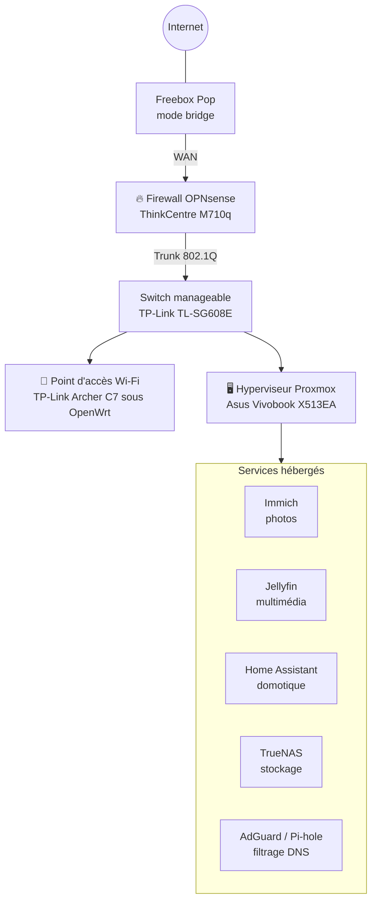

# 📓 Journal de bord — Homelab

> Conception, sécurisation et documentation d'une infrastructure réseau complète à domicile, avec un budget maîtrisé.

---

## 👋 Présentation

Ce journal retrace le projet de homelab de **[Prénom]**, étudiant en 4ᵉ année d'ingénieur en sécurité et qualité des réseaux à **[École]**.

Le projet est né d'une envie simple : **apprendre en mettant en pratique** les notions vues en cours sur une infrastructure réelle, conçue, installée et administrée de bout en bout. Il fera l'objet d'une présentation lors de la soutenance de fin d'année, mais il est avant tout mené par intérêt personnel pour le réseau et la sécurité.

---

## 🎯 Objectifs

- **Sécuriser** : un firewall dédié, une segmentation du réseau en VLAN et l'application du principe du moindre privilège entre les segments.
- **Héberger soi-même ses services** : photos, multimédia, domotique, stockage et filtrage DNS, sans dépendre de services tiers.
- **Apprendre et documenter** : chaque choix est justifié, chaque compromis est assumé, chaque erreur est consignée avec sa solution.

---

## 🗺️ Architecture cible

Le schéma ci-dessous représente l'objectif à terme. Il évoluera au fil du projet.

L'ensemble prendra place dans un **mini rack 10"** imprimé en 3D au fablab de l'école.

---

## 📖 Comment lire ce journal

- **Organisation par thèmes** : chaque chapitre couvre un élément du homelab, de l'achat jusqu'à la mise en service. La chronologie se lit dans l'historique des commits.
- **Documentation technique** : les procédures pas à pas se trouvent dans le dossier [`docs/`](docs/). Ce journal se concentre sur le *pourquoi* et le déroulé du projet.
- **Version anglaise** : un README en anglais présentera le projet de façon synthétique.
- **Confidentialité** : les informations sensibles (IP publique, mots de passe, adresses MAC, exports de configuration) sont volontairement absentes ou anonymisées.

---

## 📑 Sommaire

| Chapitre | Statut |
|---|---|
| [🔥 Firewall — OPNsense](#-firewall--opnsense) | En cours |
| 🔀 Switch et VLAN | 🕓 |
| 📶 Wi-Fi — OpenWrt | 🕓 |
| 🖥️ Proxmox | 🕓 |
| 🧩 Services | 🕓 |
| 🗄️ Rack | 🕓 |

---

## 💰 Budget

| Chapitre | Montant | Détail |
|---|---|---|
| 🔥 Firewall | 70 € | ThinkCentre M710q (55 €) ✅ + adaptateur USB-A → RJ45 (15 €) |
| 🔀 Switch et VLAN | *à compléter* | |
| 📶 Wi-Fi | *à compléter* | |
| 🖥️ Proxmox | 15 € | Adaptateur USB-C → RJ45 (15 €) |
| 🧩 Services | *à compléter* | |
| 🗄️ Rack | *à compléter* | |
| **Total** | **85 €** | *mis à jour au fil du projet* |

---

